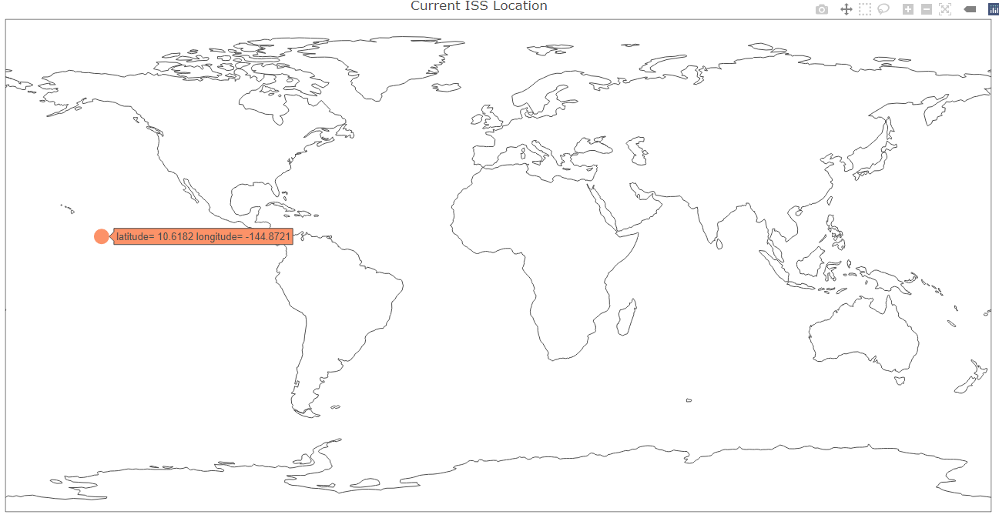

# ISS (Current Location & Crew Members)
After completed the ISS Python project, I thought it would be interesting to replicate the project in R. Since I am more familiar with R than Python, I would like to see if I could apply my R skills to accomplish the job. Luckily, I did. Still, I came across the challenge of converting a nested JSON file to tidy data frame. Eventually, found the solution and learnt a great lesson. Details see the script.

